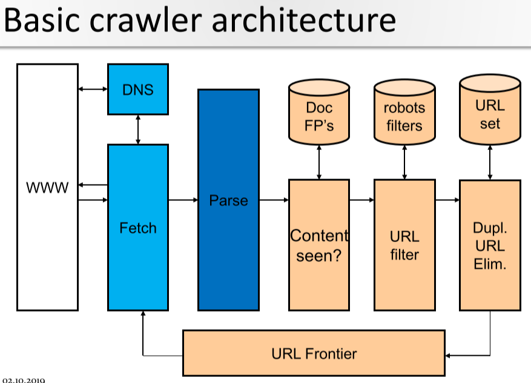
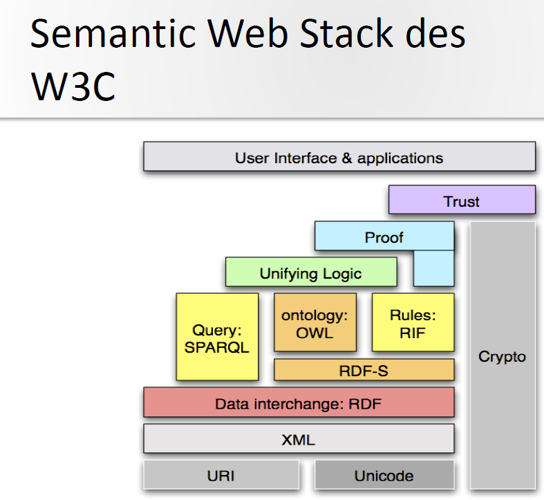

# Information Retrieval
## Buzzword Bingo
- Information Retrieval (IR)
  - finding material (usually
documents) of an unstructured nature (usually text)
that satisfies an information need of users from within
large collections of documents (usually stored on
computers).
- IR Process
  - Data -> Create Document Representation -> Index Docs -> Ready
    - Done beforehand
  - User query -> create query representation -> Search Indexed Docs -> Order
- Retrieval Model
  - Quality of a retrieval model depends on how well it
matches user needs !
  - Determines
    - the structure of the document representation
    - the structure of the query representation
    - the similarity matching function
- Query
  - what users look for
  - list of words or phrases
- Document
  - Data
  - Bag of words
- Corpus/Collection
  - Set of documents
- Index
  - representation of information to make querying easier
  - Manual Indexing
    - Pro: Human indexers can establish relationships and
concepts between seemingly different topics that
can be very useful to future readers
    - Con: Slow and expensive 
  - Automatic Indexing
    - Inverted Index
      - map terms to docs
      - finds docs matching query
      - 
    - Indexing with Controlled Vocabulary
      - Find synonyms
      - describe concepts with lists of terms
      - e.g. Vehicle, Car, Mercedes, Taxi all describe the same concept
      - can increase performance 
    - Vector Space Models
      - map docs to terms
      - find docs matching query
      - ranks docs for best match
- Controlled Vocabulary
  - relationship between terms
  - find synonyms
  - List
    - e.g. alphabetical list
  - Ring
    - set of X terms
    - used in search engines
  - Taxonomy
    - hiarchical classification system
    - each term has one or more broader terms except the top term
    - each term has one or more narrower terms except the bottom terms
  - Thesaurus
    - taxonomy + additional relationships
- Boolean Queries
  - OR
  - AND
  - BUT
  - Ranking hard => yes, no answer
  - Relevance feedback hard => no ranking
  - all matched docs are returned
  - complex requests hard to write
- Union
  - everything in A + everything in B = OR
- Intersection
  - What's in both = AND
  - performance -> start with smallest set then keep ANDing
- Difference
  - (A OR B) - (A AND B) = BUT 
- Term
  - word/concept in document or query
  - weighting 
    - too frequent
    - significant
    - too rare
    - document with 10 occurences of a term is more important than a document with 1 occurance BUT not 10 times as important => weighting becasue relevance doesn't increase proportionally
- Dictionary
  - sorted list of terms used by the index
- Document Processing Pipeline / Normalization
  - Text
  - remove properties and formatting
  - parse
  - remove stopwords
  - stemming or lemmatization
  - synonym matching
  - indexing
- Token
  - small unit of meaningful text
- Tokenization
  - break into tokens on whitespaces
- Tokenization Problems
  - Specific domains like biomedical texts have lots of unusual symbols/special terms that should be interpreted correctly
  - Semantic meaning could be lost
- Lemmatization/Stemming
  - Stem = cut off
    - walk, walked, walking => walk => walk(ed | ing)
  - Lemmatizaton = get words like in dictionary through morphological analysis
- Morphology
  - knowledge how words are morphed => write, wrote, written = write
- Stop Word removal
  - Stop Word
    - small/no semantic content
    - the, a, an, is
- Ranked Retrieval
  - more relevant = higher up
  - Jaccard Coefficinet
    - CONS:
      - term frequency doesn't matter
      - but rare terms are more informative than frequent ones
  - Statistical Models
    - vector space model
    - statistical info used for ranking => term frequency
    - Ranked based on similarity to query
    - similarity based on frequency of keywords
- Vector Space Model
  - Docs and queries are represente as N-dimensional vectors
  - Terms get a weight
  - Terms = Axes of the Vector Space
  - Documents are points or vectors in the vector space
  - Document collection can be represented as term-document matrix
    - Entry = Weight of term in a document
    - Term Frequnecy = frequenzy / most commont term
  - Document frequency
    - number of documents containing the term
  - Inverse Document Frequency
    - Terms that appear in many different documents are less
  - CONS
    - missing semantic info
    - missing syntactic info
    - assumption of term independenc (ignores synonyms)
    - Lacks the control of a Boolean model (e.g.,
indicative of overall topic
  - Term Frequency + Inverse Document Frequency:
    - TF-IDF Weighting
    - most common term weighting approach (vector-space model)
    - A term occurring frequently in the document but rarely in the rest of the collection is given high weight
- Similarity
  - Euclidean distance
  - Vector Product
  - Cosine similarity
  
# Clustering Classification
## Buzzword Bingo
- Clustering
  - infers groups based on clustered objects
  - the process of grouping a set of objects (documents) into classes of similar objects (documents)
  - most common form of unspervised learning
  - Docs in same cluster behave similar with respect to relevance to information needs
  - Applications
    - Speed up vector space retrieval
    - imporved recall => better search results
  - Requirements
    - 
  - Problems
    - 
  - Documents within a cluster should be similar
  - Documents from different clusters should be dissimilar
  - Algos
    - Distance Based
      - K Means
      - single-pass
    - Hirarchical
      - Bottom Up
      - Top Down
    - Other
      - Suffix Tree Clustering
- Pipeline
  - Partitioning Algo
    - create k clusters
- K-Means
  - clusters based on centroids
  - Reassignment of instances to clusters is based on distance to the current cluster centroids
- Hard Clustering
  - one doc => one cluster
  - K-means
- Soft Clustering
  - one doc => set of clusters
  - gives a probability that a doc belongs to a specific cluster
  - Sum of possibilties = 1
  - Types
    - Fuzzy Clustering (pattern recognition)
    - soft K-means
- Naive Bayes Model
  - 
- Expectation Maximization Algo
  - uses bayes model
  - Expectation
    - Use naive bayes to compute probability => soft label
  - Maximization
    - use standard naives bayes training to learn to re-estimate params
- Hirarchical clustering - HAC
  - 
  - 
- Buckshot Algo
  - HAC + K-means
- When is clustering good?
  - nodes in a cluster similar (intra-calss similarity = high)
  - nodes in other clusters different (inter-class similarity = low)
- Cluster Quality Evaluation
  - purity
    - ratio of dominant class and the size of the cluster
  - entropy of classes
    - mutual information
- Silhouette Values
  - Good clusters have the property that cluster members are close to each other and far from members of other clusters
- 

- Classification
  - assigns objects to predefined groups
  - Rocchio Method
    - tf-idf weights
    - assign to the closest centroid
  - k Nearest Neighbor kNN
# Information Extraction
- Identify specific pieces of information (data) in a unstructured or semi structured textual document.
- Transform unstructured information of a corpus of documents or
web pages into a structured database
- processing human language documents utilizing natural
language processing (NLP)
- current approaches to IE focus on narrowly restricted domains:
sports, medicine, business
- Extraction of
  - Entities => e.g. Person => You
    - Generic => Person, Organization, ...
    - Custom => domain specific e.g. Drugs, Deseases
    - Numeric => Time, Date, Numbers
  - Attributes => e.g. Title of a Person => BSc
  - Facts => relations between entities => Suckerberg works at Facebook
  - Events => activity or occurance => NSA - terroristic acts, ABC merges with BBC etc.
- NER - Named Entity Recognition
  - mark each element which represents
    - person
    - company
    - country
    - ...
  - NER involves identification of proper names in texts, and classification into a set of predefined categories of interest
  - 
  - Extract Content
    - remove irrelevant content = junk
      - Pictures
      - Tables
      - Diagrams
      - Adds
  - Tokenization
    - extract tokens
    - Problems
      - symbols like (. , : "" '' ...)
  - Sentence Segmentation
    - Nomen est Omen
  - POS Tagging
    - Assign types to words
      - Noun
      - Adjective
      - Verb
      - ...
    - Problem: ambiguity
    - Rule based approach
      - analyze word, word before, word after etc.
      - analyze surrounding context
    - Probabilistic Approach
      - How common is it that this type of word is after such a type of word
    - Unigram Tagger
      - assign most likely tag to token
    - Stochastic / N-gram / HMM
    - N-gram
      - generalization of unigram tagger
      - look at sequences of words and assign tags
      - consider all possible combination and take the most likely one
    - HMM-based tagging
      - (Informally) Markov models are the class of probabilistic models that assume we can predict the future without taking too much account of the past
    - Bigram Tagger
      - assign tags to groups of two words
    - Phrase Structure
      - identify syntactical froups within a sentence
        - Noun Phrase
        - Verb Phrase
      - Chunking (Partial Parsing)
        - divide sentence in prase chunks
    - Recognize Entities
      - find named entities
        1) Segmentation
        2) Classification
  - Morphology
    - get root form of a word
    
- Sequence Labeling
  - Local: the previous label
  - Global: lable by maximizing on the whole sentence
- TE - Tempalte Element Task
  - generic object with attributes
  - draws evidence from everywhere in the text 
- TR - Tempalte Realtion
  - find the relationship
  - e.g. employee_of, product_of, location_of
- ST - Scenario Template Task
  - extract specific event information
  - relate info to organization/person/artifact
- CO - Coreference Task
  - ???
- Examples of IE
  - Disaster Events
- Components of an IE system
  1) Tokenization
     - split input into parts = tokes
  2) Morphological and lexical analysis
     - Part of Speech - POS Tagging 
       - assign type to word (verb, noun, adjective, ...)
     - disambiguating the sense of ambigous words
       - words that are written the same but have different meanings
       - flies => the flies sit on a pile of shit, or a bird flies
  3) Syntactic analysis
     - connection between parts of a sentence
  4) Domain analysis
     - combine all info from the steps before
     - describes relationship between entities
     - CO COreference Resolution - Anaphora Resolution
       - match indirect references
       - e.g. they in the next sentence refers to an entity from the privioud one
  5) Integration
     - Merge results with oter IE systems (Onthologies)
- Evaluation
  - Precision
    - probability that retrieved doc is relevant
  - Recall
    - probability that relevant doc is retreived in a search
  - F-measure
    - combines precision and recall
# Web Search & Crawling
- User Needs
  - Informational
  - Navigational
  - Transactional
- Result Quality
  - Relevance not enough
  - Trustworthy?
- Precision vs Recall
  - Precision
  - Recall: not relevant in Web
- Crawler Operations
  - begin with known URLs
  - fetch and parse them
    - extract URLs
    - Place extracted URL on queue
  - Fetch each URL on the queue and repeat
- Crawler Props
  - DISTRIBUTED SYSTEM => one crawler not feasible
  - Malicious pages
    - SPAM
    - Spider Traps
  - Non Malicious
    - Latency can be an issue
    - How deep should you crawl a sites URL hierarchy?
    - Duplicate pages
- What Crawlers must do
  - be polite
    - only allowed pages
  - be robust
    - spider traps etc.
- What Crawlers should do
  - distribute operations
  - be scalable
  - perfomance
  - high quality pages first
  - continous operations
    - check sites in cycles
  - Extensible
    - new data formats
- Crawling steps
  - pick URL
  - fetch document at URL
  - parse URL
    - link extraction
  - Check if URL has content already seen
    - if not add indices
  - For each extracted URL
    - pass URL filter test
    - check if it is in frontier
  - 
- URL Frontier
  - multiple pages from the same host possible
  - avoid fetching them all at the same time
  - try to keep crawling threads busy
- DNS
  - get IP to URL
  - use DNS caching (lookups can take seconds)
  - Batch DNS requests
- Parsing - URL Normalization
  - some extracted links are relative URLs
  - solution
    - expand URLs => absolute path
- Content already seen?
  - duplication widespread
  - if a page is in the index do not process it
  - verify with
    - doc fingerprint e.g. Hash
    - shingles = compare text parts (Shingle)
- Duplicate URL Eliminator
  - one-shot crawl => just once not continuous
## Link Analysis
- The Web is a directed graph
- Indexing anchor text
  - can score anchor text with a weight depending on the authority of the anchor page's website
- Citation Analysis
  - citation frequency
  - Co-citation coupling frequency
  - Citation Indexing
  - Pagerank preview
- Query independent ordering
  - count links
    - undirected = inlink + outlink
    - directed = inlink
- Page Rank
- Topic specific Page Rank
- HITS
  - hub page
  - authority page
- High-level scheme

# Semantic Knowledge Models, Semantic Web Stack
- Semantics = study of meaning
- common languages
  - Index = common terms and symbols
  - Glossary = their meaning => vocabulary in a domain with definitions for terms
  - Taxonomy = classification of concepts
    - hierarchical classification
    - classes of objects and relations between them
    - NO description or definition of objects
  - Thesaurus = Associations between concepts
    - is unambigious - UNLIKE NATURAL LANGUAGE
    - It is a model that attempts to describe and represent a topic exactly
    - a systematically ordered collection of concepts
    - controlled vocabulary => (attribute, value, range)
    - manages synonyms, broader/narrower and related terms
  - Map
    - spatial visualization of the structure
      - representation) provides information on the semantic meaning of what is shown 
      - content
      - ideas and knowledge
      - information and resources
  - Topic Map
    - is the collection of knowledge on subjects
    - TAO
      - Topic = concept => person
      - Association = realtionship between concepts e.g. mother
      - Occurence = representation of information resources on a specific topic
  - Onthology = Rules and knowledge about which crosslinks are permitted
    - explicit specification of a conceptualization
    - agreement among people with a common motive of sharing
    - defines a common vocabulary for info sharing in a domain
    - purpose
      - structuring
      - communication
      - interoperability
      - data exchange
      - systems engineering, reliability, reusability, ...
    - Components
      - concepts
      - types
      - individuals
      - properties
      - inheritance
      - axioms
        - a truth that's not questioned anymore
      - desribes a segment of the world in a given domain
      - Things = concepts
        - classes
        - individuals
      - concepts have
        - props
          - follow restrictions
        - relationships
          - follow restrictions
      - 
  - Folksonomy
    - Social network => social tagging in social software
    - generated by machines
    - no
      - hierarchy
      - quality control
      - sound theory
- Web 2.0
  - users are now prosumers (producer + consumer)
  - users create and edit content themselves
    - wikis, blog, sharing (youtube), social networks
- Web 3.0
  - extension of the current web
  - give content meaning and connect content
  - improves machine-human interaction
  - based on RDF
  - is a common framework for information sharing
  - W3C
  - Semantic Web Stack
    - 
    - Character Set
      - Unicode
        - basic coding standard
      - URI
        - Unambigous identification of resources
        - only ASCII chars
        - URIs are the standard for the identification of (online) resources
        - Resources are objects
      - IRI
        - uses UNICODE character set > ASCII
    - XML
      - extended markup language
      - syntax basis
      - Namespaces
        - allows usage of the same tag in different contexts
    - RDF
      - assigns specific URIs to its individual fields
      - RDF 
        - provides assertion
        - is machine processable
        - is defined by a set of triplets
        - Resources are identified by URIs
        - Predicates are defined by the RDF vocab
        - namespaces shorten URIs
        - RDFS
          - RDF Schema
          - onthology language
          - allows the creation of vocabs
          - classes, properties, domains, ranges, inheritance (class and property), containers
          - meaningless statements can be prevented through the use of classes
            - e.g. only authors can write books
            - e.g. only books can be written
    - OWL - Web Onthology Language
      - based on RDF
      - higher expressiveness than RDF
      - allows complex relationships
    - Rule SWRL und RIF
      - SWRL
        - OWL + Rule markup language
      - RIF
        - Rule Interchange Format
        - translation between rule languages
    - SPARQL
      - RDF query language
    - Logic Framework
      - inference engine
      - draw conclusions
      - derive new knowledge
      - proof is hard
      - apply rules and draw conclusions
    - Trust
      - required to check the validity of information
      - trustworthiness of the source
      - authenticity of the source
      - digital signatures => to ensure
    - Cryptography
      - ensure data security
    - User Interface & Applications
      - use semantic web applications
      - Tools
      - 
# Knowledge Engineering & Onthology Description
- Kowledge Engineering
  - Knowledge Base
    - facts
    - rules
  - Inference Engine
    - Brain
    - new knowledge generated by inference
  - User Interface
    - Fill KB 
    - Query
    - inference results
    - update knowledge
  - Knowledge Aquisition
    - get expert knowledge
  - Formalization
  - Knowledge Processing
    - for problem solving
    - e.g. inference
  - Knowledge Representation
    - UI
  - Phases
    - indentify task
    - LOOP
      - Knowledge acquisition
      - ontohology => specify vocabulary
      - formalization => Axioms and instances
      - inference procedure => Evaluate + Test
      - implementation, maintenance
    - END LOOP
    - Phase 1 - Problem Description
      - identify task
      - specify domain
      - elect experts => Competence questions
    - Phase 2 - Knowledge Acquisition
      - gather knowledge
      - direct
        -  expert does it
      - indirect
        -  knowledge engineer uses KM methods with experts
      - autoamted
        - machine learning
      - model-based
        - KM models
      - list important concepts
        - wine
        - grape type
        - color
        - taste
        - ...
      - documentation
    - Phase 3 - Conceptualization
      - specify the vocabulary 
        - onthology
      - cognitive to representation level
      - consisten representation of knowledge
      - define classes and the hierarchy
        - Taxonomy = Hierarchy:
          - Wine
            - Red
              - Cabernet Franc
              - Pinot Noir
              - ...
            - White
              - ...
            - Rose
              - ...
    - Phase 4 - Formalization
      - Instances
      -  Axioms
         -  Inheritance
         -  Disjunction
      - Constraints
        - cardinality
        - transitivity
        - symmetry
      - DEFINE
        - relationships
        - properties / slots
        - values / facts
    - Phase 5 - Evaluation
      - Inference
      - Validate acquired knowledge
        - completeness
        - reliability
      - Iterate if necessary => continue with Phase 2
    - Phase 6 - Implementation and Maintenance
      - Implementation
      - UI
        - query
        - explanation/visualizaton component
        - manipulation component
## Onthology description language
- Why?
  - base for data and knowledge sharing
  - common vocab
  - same understanding of terms
  - Automation (Reasoning)
    - derive implicit knowledge
    - identify inconsistency
    - determine concept hierarchies
- Onthologies
  - set of concepts
  - and relationships between them
  - includes
    - description and definition of terms/concepts
    - properties
    - relationships
    - limitations
    - inference and integrity rules
    - individuals
- RDF 
  - basic onthology language
  - SPO Triples
  - (subject, predicate, object)
  - (resource, property, property value)
  - (kasperl, hasFriend, Pezi)
  - resource = object
  - resource identified with URI
- RDFS
  - classes, properties and hierarchies
  - inheritance => subclassOf
- OWL
  - Domains and Ranges are AXIOMS not constraints
  - Object property = link to individual
    - inverse
      - hasPartent/isParent
    - functional
      - exactly one individual is in relation with this property
      - hasBirthmothe
    - inverse functional
      - the inverse property is functional
      - isBirthmotherOf
    - transitiv 
      - has ancestor
    - symmetric
      - hasSibling
    - asymmetric
      - hasChild
    - reflexive
      - must relate to self
      - knows
    - irreflexive
      - relates a and b
      - a and b cannot be the same individual
      - isMotherOf
  - Datatype Property
    - functional = only one value allowed
    - else = multiple values allowed
  - Datatype property = link to XML schema/datatype value or rdf literal
  - Annotation properties
    - add info
  - Describe a detail of the world:
    - What things are there?
    - What is the relation of these things?
    - What characteristics do these things and the relationships with each other have?
  - Ontology description = Syntax
  - Ontology rules = Semantics
  - Types
    - Named class
    - disjoint
    - union
    - complementary
    - anonymous
    - enumeration
  - Anonymous class
    - pattern matching
    - classification
    - limited on properties
    - e.g. all elements which have a hasFriend relationship
- Primitive Classes
  - A member of a named class must satisfy the conditions
  - An individual which satisfies the conditions is not necessarily an element from the named class
- Defined Class
  - Elements of the defined class satisfy the conditions
  - if an element satisfies the conditions it is also the defined class
- Necessary vs . Necessary and Sufficient Conditions
- Partial vs . Complete Definitions
- Open World
  - All that's not explicitly marked as impossible can exist
  - OWL
- Closed World
  - All that's not explicitly allowed is impossible
  - Database
- Rules - SWRL
  - more powerful deductive reasoning
  - body -> head
  - body and head = conjunction of atoms
  - atom = (arg1, arg2, ..., argN)
  - Class Atom
    - Person(?p)
  - Individual Property Atoms
    - hasBrother(?x, ?y)
  - Data Valued Property Atoms
    - hasAge(?x, ?age)
  - Different and Same Individuals
    - differentFrom(?x, ?y)
  - 
# SPARQL
- Queries
  - SELECT
    - get
  - ASK
    - true/false
  - CONSTRUCT
    - get RDF Graph
  - DESCRIBE
    - get RDF graph describing resources
    - not important
- SQL like
- not XML like
- 