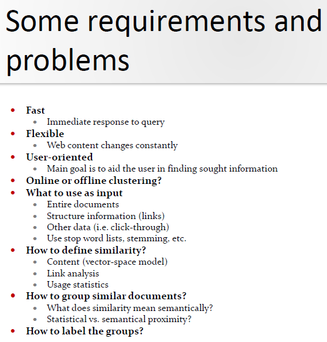

# Information Retrieval
## Buzzword Bingo
- Information Retrieval (IR)
  - finding material (usually
documents) of an unstructured nature (usually text)
that satisfies an information need of users from within
large collections of documents (usually stored on
computers).
- IR Process
  - Data -> Create Document Representation -> Index Docs -> Ready
    - Done beforehand
  - User query -> create query representation -> Search Indexed Docs -> Order
- Retrieval Model
  - Quality of a retrieval model depends on how well it
matches user needs !
  - Determines
    - the structure of the document representation
    - the structure of the query representation
    - the similarity matching function
- Query
  - what users look for
  - list of words or phrases
- Document
  - Data
  - Bag of words
- Corpus/Collection
  - Set of documents
- Index
  - representation of information to make querying easier
  - Manual Indexing
    - Pro: Human indexers can establish relationships and
concepts between seemingly different topics that
can be very useful to future readers
    - Con: Slow and expensive 
  - Automatic Indexing
    - Inverted Index
      - map terms to docs
      - finds docs matching query
      - 
    - Indexing with Controlled Vocabulary
      - Find synonyms
      - describe concepts with lists of terms
      - e.g. Vehicle, Car, Mercedes, Taxi all describe the same concept
      - can increase performance 
    - Vector Space Models
      - map docs to terms
      - find docs matching query
      - ranks docs for best match
- Controlled Vocabulary
  - relationship between terms
  - find synonyms
  - List
    - e.g. alphabetical list
  - Ring
    - set of X terms
    - used in search engines
  - Taxonomy
    - hiarchical classification system
    - each term has one or more broader terms except the top term
    - each term has one or more narrower terms except the bottom terms
  - Thesaurus
    - taxonomy + additional relationships
- Boolean Queries
  - OR
  - AND
  - BUT
  - Ranking hard => yes, no answer
  - Relevance feedback hard => no ranking
  - all matched docs are returned
  - complex requests hard to write
- Union
  - everything in A + everything in B = OR
- Intersection
  - What's in both = AND
  - performance -> start with smallest set then keep ANDing
- Difference
  - (A OR B) - (A AND B) = BUT 
- Term
  - word/concept in document or query
  - weighting 
    - too frequent
    - significant
    - too rare
    - document with 10 occurences of a term is more important than a document with 1 occurance BUT not 10 times as important => weighting becasue relevance doesn't increase proportionally
- Dictionary
  - sorted list of terms used by the index
- Document Processing Pipeline / Normalization
  - Text
  - remove properties and formatting
  - parse
  - remove stopwords
  - stemming or lemmatization
  - synonym matching
  - indexing
- Token
  - small unit of meaningful text
- Tokenization
  - break into tokens on whitespaces
- Tokenization Problems
  - Specific domains like biomedical texts have lots of unusual symbols/special terms that should be interpreted correctly
  - Semantic meaning could be lost
- Lemmatization/Stemming
  - Stem = cut off
    - walk, walked, walking => walk => walk(ed | ing)
  - Lemmatizaton = get words like in dictionary through morphological analysis
- Morphology
  - knowledge how words are morphed => write, wrote, written = write
- Stop Word removal
  - Stop Word
    - small/no semantic content
    - the, a, an, is
- Ranked Retrieval
  - more relevant = higher up
  - Jaccard Coefficinet
    - CONS:
      - term frequency doesn't matter
      - but rare terms are more informative than frequent ones
  - Statistical Models
    - vector space model
    - statistical info used for ranking => term frequency
    - Ranked based on similarity to query
    - similarity based on frequency of keywords
- Vector Space Model
  - Docs and queries are represente as N-dimensional vectors
  - Terms get a weight
  - Terms = Axes of the Vector Space
  - Documents are points or vectors in the vector space
  - Document collection can be represented as term-document matrix
    - Entry = Weight of term in a document
    - Term Frequnecy = frequenzy / most commont term
  - Document frequency
    - number of documents containing the term
  - Inverse Document Frequency
    - Terms that appear in many different documents are less
  - CONS
    - missing semantic info
    - missing syntactic info
    - assumption of term independenc (ignores synonyms)
    - Lacks the control of a Boolean model (e.g.,
indicative of overall topic
  - Term Frequency + Inverse Document Frequency:
    - TF-IDF Weighting
    - most common term weighting approach (vector-space model)
    - A term occurring frequently in the document but rarely in the rest of the collection is given high weight
- Similarity
  - Euclidean distance
  - Vector Product
  - Cosine similarity
  
# Clustering Classification
## Buzzword Bingo
- Clustering
  - infers groups based on clustered objects
  - the process of grouping a set of objects (documents) into classes of similar objects (documents)
  - most common form of unspervised learning
  - Docs in same cluster behave similar with respect to relevance to information needs
  - Applications
    - Speed up vector space retrieval
    - imporved recall => better search results
  - Requirements
    - 
  - Problems
    - 
  - Documents within a cluster should be similar
  - Documents from different clusters should be dissimilar
  - Algos
    - Distance Based
      - K Means
      - single-pass
    - Hirarchical
      - Bottom Up
      - Top Down
    - Other
      - Suffix Tree Clustering
- Pipeline
  - Partitioning Algo
    - create k clusters
- K-Means
  - clusters based on centroids
  - Reassignment of instances to clusters is based on distance to the current cluster centroids
- Hard Clustering
  - one doc => one cluster
  - K-means
- Soft Clustering
  - one doc => set of clusters
  - gives a probability that a doc belongs to a specific cluster
  - Sum of possibilties = 1
  - Types
    - Fuzzy Clustering (pattern recognition)
    - soft K-means
- Naive Bayes Model
  - 
- Expectation Maximization Algo
  - uses bayes model
  - Expectation
    - Use naive bayes to compute probability => soft label
  - Maximization
    - use standard naives bayes training to learn to re-estimate params
- Hirarchical clustering - HAC
  - 
  - 
- Buckshot Algo
  - HAC + K-means
- When is clustering good?
  - nodes in a cluster similar (intra-calss similarity = high)
  - nodes in other clusters different (inter-class similarity = low)
- Cluster Quality Evaluation
  - purity
    - ratio of dominant class and the size of the cluster
  - entropy of classes
    - mutual information
- Silhouette Values
  - Good clusters have the property that cluster members are close to each other and far from members of other clusters
- 

- Classification
  - assigns objects to predefined groups
  - Rocchio Method
    - tf-idf weights
    - assign to closest centroid
  - k Nearest Neighbor kNN
# Information Extraction
- Identify specific pieces of information (data) in a unstructured
or semi structured textual document.
- Transform unstructured information of a corpus of documents or
web pages into a structured database
- processing human language documents by means of natural
language processing (NLP
- current approaches to IE focus on narrowly restricted domains:
sports, medicine, business
- Extraction of
  - Entities => e.g. Person => You
    - Generic => Person, Organization, ...
    - Custom => domain specific e.g. Drugs, Deseases
    - Numeric => Time, Date, Numbers
  - Attributes => e.g. Title of a Person => BSc
  - Facts => relations between entities => Suckerberg works at Facebook
  - Events => activity or occurance => NSA - terroristic acts, ABC merges with BBC etc.
- NER - Named Entity Recognition
  - mark each element which represents
    - person
    - company
    - country
    - ...
  - NER involves identification of proper names in texts, and classification into a set of predefined categories of interest
  - 
  - Extract Content
    - remove irrelevant content = junk
      - Pictures
      - Tables
      - Diagrams
      - Adds
  - Tokenization
    - extract tokens
    - Problems
      - symbols like (. , : "" '' ...)
  - Sentence Segmentation
    - Nomen est Omen
  - POS Tagging
    - Assign types to words
      - Noun
      - Adjective
      - Verb
      - ...
    - Problem: ambiguity
    - Rule based approach
      - analyze word, word before, word after etc.
      - analyze surrounding context
    - Probabilistic Approach
      - How common is it that this type of word is after such a type of word
    - Unigram Tagger
      - assign most likely tag to token
    - Stochastic / N-gram / HMM
    - N-gram
      - generaliztion of unigram tagger
      - look at sequences of words and assign tags
      - consider all possible combination and take the most likely one
    - HMM based tagging
      - (Informally) Markov models are the class of probabilistic models that assume we can predict the future without taking too much account of the past
    - Bigram Tagger
      - assign tags to groups of two words
    - Phrase Structure
      - identify syntactical froups within a sentence
        - Noun Phrase
        - Verb Phrase
      - Chunking (Partial Parsing)
        - divide sentence in prase chunks
    - Recognize Entities
      - find named entities
        1) Segmentation
        2) Classification
  - Morphology
    - get root form of a word
    
- Sequence Labeling
  - Local: previous label
  - Global: lable by maximizing on the whole sentence
- TE - Tempalte Element Task
  - generic object with attributes
  - draws evidence from everywhere in the text 
- TR - Tempalte Realtion
  - find the relationship
  - e.g. employee_of, product_of, location_of
- ST - Scenario Template Task
  - extract specific event information
  - relate info to organization/person/artifact
- CO - Coreference Task
  - ???
- Examples of IE
  - Disaster Events
- Components of an IE system
  1) Tokenization
     - split input into parts = tokes
  2) Morphological and lexical analysis
     - Part of Speech - POS Tagging 
       - assign type to word (verb, noun, adjective, ...)
     - disambiguating the sense of ambigous words
       - words that are written the same but have different meanings
       - flies => the flies sit on a pile of shit, or a bird flies
  3) Syntactic analysis
     - connection between parts of a sentence
  4) Domain analysis
     - combine all info from the steps before
     - describes relationship between entities
     - CO COreference Resolution - Anaphora Resolution
       - match indirect references
       - e.g. they in the next sentence refers to an entity from the privioud one
  5) Integration
     - Merge results with oter IE systems (Onthologies)
- Evaluation
  - Precision
    - probability that retrieved doc is relevant
  - Recall
    - probability that relevant doc is retreived in a search
  - F-measure
    - combines precision and recall
# Web Search & Crawling

# Semantic Knowledge Models, Semantic Web Stack

# Knowledge Engineering & Onthology Description

# OWL DL Example

# Queries und Ausdruck
